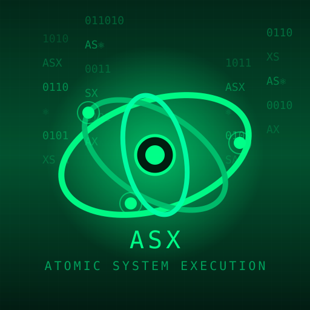

# MATRIX

**MATRIX** is a distributed AI code agent orchestration system. It bridges a PHP broker to AI coding assistants like Claude Code, Codex, and Aider.

## Core Components

- **PHP Broker API** - REST API that queues and distributes tasks
- **Python Agent** - Bridges broker to AI code agents (Claude, Codex, Aider)
- **PWA Frontend** - Web interface for managing tasks
- **MX2LM CLI** - KUHUL-controlled host orchestrator

## Quick Start

### 1. Install an AI Code Agent

```bash
# Claude Code (recommended)
npm install -g @anthropic-ai/claude-code

# or Codex
npm install -g codex

# or Aider
pip install aider-chat
```

### 2. Set API Key

```bash
# For Claude
export ANTHROPIC_API_KEY="sk-ant-..."

# For Codex
export OPENAI_API_KEY="sk-..."
```

### 3. Configure & Run Agent

```bash
cd agent
pip install -r requirements.txt
python agent.py
```

### 4. Send a Prompt

```bash
curl -X POST http://127.0.0.1:5001/prompt \
  -H "Content-Type: application/json" \
  -d '{"prompt": "Add a hello world function to main.py"}'
```

## Project Structure

```
MATRIX/
├── api/                    # PHP Broker API
│   ├── agents.php          # Agent management
│   ├── tasks.php           # Task listing
│   ├── add_task.php        # Create tasks
│   ├── get_task.php        # Agent polling
│   ├── submit_result.php   # Result submission
│   └── schema.sql          # MySQL schema
│
├── agent/                  # Python Agent (AI Bridge)
│   ├── agent.py            # Main agent script
│   ├── agent_config.json   # Configuration
│   └── requirements.txt    # Python dependencies
│
├── cli/                    # MX2LM CLI
│   ├── server.khl          # Server runtime
│   ├── server/             # CLI module
│   └── ui/                 # CSS Micronaut UI
│
├── pwa/                    # Progressive Web App
│   ├── index.html          # Main interface
│   └── sw.js               # Service worker
│
├── docs/                   # Documentation
│   ├── ai-agents.md        # AI Agent integration
│   ├── mx2lm-cli.md        # CLI specification
│   └── mxs.md              # MXS specification
│
├── specs/                  # Language Specifications
│   ├── mxs/                # MXS stylesheets
│   └── server/             # Server schemas
│
├── inference/              # Inference Plains
├── experimental/           # POC code (Kuhul)
└── assets/                 # Logos
```

## AI Agent Integration

The Python agent bridges the PHP broker to AI code agents:

```
PHP Broker → Python Agent → AI Code Agent → Codebase
```

### Supported Agents

| Agent   | Package                      | API Key Variable      |
|---------|------------------------------|-----------------------|
| Claude  | `@anthropic-ai/claude-code`  | `ANTHROPIC_API_KEY`   |
| Codex   | `codex`                      | `OPENAI_API_KEY`      |
| Aider   | `aider-chat`                 | (various)             |

### Configuration

Edit `agent/agent_config.json`:

```json
{
  "broker_url": "https://yourdomain.com/api",
  "agent_name": "Agent1",
  "ai_agent": "claude",
  "working_dir": "/path/to/project"
}
```

### API Endpoints

| Endpoint      | Method | Description                    |
|---------------|--------|--------------------------------|
| `/prompt`     | POST   | Send prompt to AI agent        |
| `/shell`      | POST   | Execute shell command          |
| `/status`     | GET    | Get agent status               |
| `/agents`     | GET    | List available AI agents       |

See [docs/ai-agents.md](docs/ai-agents.md) for full documentation.

## PHP Broker API

Deploy to any PHP hosting:

1. Upload `api/` folder and `config.php`
2. Import `api/schema.sql` into MySQL
3. Configure database credentials in `config.php`

## MX2LM CLI

KUHUL-controlled server lifecycle with π-decay restart logic:

```bash
node cli/server/index.js start
node cli/server/index.js status
```

| π Support | Restart Policy       |
|-----------|----------------------|
| `< 0.4`   | Suppress restart     |
| `0.4–0.7` | Restart once         |
| `> 0.7`   | Restart with backoff |
| `> 0.9`   | Immediate heal       |

See [docs/mx2lm-cli.md](docs/mx2lm-cli.md) for full specification.

## Architecture

```
PHP Broker API (task queue)
        ↓
Python Agent (bridge)
        ↓
AI Code Agent (Claude/Codex/Aider)
        ↓
MX2LM CLI (host orchestrator)
        ↓
KUHUL π (intent physics)
```

| Layer          | Role              |
|----------------|-------------------|
| PHP Broker     | Task distribution |
| Python Agent   | AI bridge         |
| AI Agent       | Code execution    |
| MX2LM CLI      | Host control      |
| KUHUL          | Physics engine    |

## PowerShell Examples

```powershell
# Start agent in new window
Start-Process powershell -ArgumentList "python agent/agent.py"

# Send prompt via curl
Invoke-RestMethod -Uri "http://127.0.0.1:5001/prompt" `
  -Method POST `
  -ContentType "application/json" `
  -Body '{"prompt": "Fix the bug in auth.py"}'

# Check status
Invoke-RestMethod -Uri "http://127.0.0.1:5001/status"
```

## License

UNLICENSED
